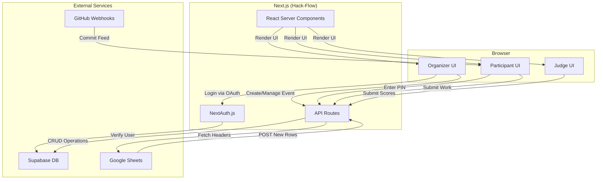

# Hack-Flow: The High-Octane Event Engine

Hack-Flow is a standalone, multi-tenant Hackathon-as-a-Service (HaaS) platform designed to provide a frictionless, temporary workspace for hackathons. It serves as the event engine for the **University Project Hub**, enabling organizers to seamlessly manage events and providing a bridge for participants to save their work permanently back to the main Hub.

## Core Technologies

- **Framework**: Next.js 15 (App Router)
- **Styling**: Tailwind CSS
- **Authentication**: NextAuth.js
- **Database**: Supabase (PostgreSQL)
- **Deployment**: Vercel / Netlify

---

## Project Status

### ✓ Completed

- **Initial Project Setup**: Next.js 15 project initialized with App Router.
- **Authentication Core**: Base NextAuth.js configuration established in `app/api/[...nextauth]/route.ts`, ready for provider integration.
- **Database Client**: Supabase client integration is complete (`lib/supabase.ts`), allowing for communication with the database.
- **Dynamic Index Mapping UI**: The front-end component for mapping spreadsheet columns to system keys is implemented in `components/dashboard/registry-uplink.tsx`.

### Upcoming Features

- **Database Schema & RLS**: Implement the full Supabase SQL schema with strict Row-Level Security for organizers.
- **API Endpoints**:
    - `/api/register`: Build the API route to ingest POST requests from the Google Apps Script.
    - API routes for all participant and judge actions.
- **Organizer Pipeline**:
    - Event Creation form.
    - Google Apps Script generator.
    - Admin Triage Dashboard with data table, edit modal, and action toggles.
    - Venue QR Scanner view.
- **Participant Lab**:
    - PIN-first authentication gateway.
    - "Mission Control" dashboard UI.
    - Real-time "Engineering Pulse" with GitHub and deployment feeds.
    - "Proof of Work" Kanban board with commit URL validation.
    - Read-only lock mechanism triggered by the event deadline.
- **Judging & Evaluation**:
    - Restricted Judging Portal with a weighted scoring matrix.
    - Live Leaderboard.
- **Monetization & Architecture**:
    - `useEntitlement()` hook for future premium features.
    - Cron job for ephemeral data cleanup.

---

## Project Architecture



---

## Core Modules & User Flows

### A. The Organizer Pipeline
Organizers log in via OAuth to create events, map data from Google Sheets, generate an integration script, and manage registrations through a triage dashboard.

### B. The Participant Lab
Students enter via a PIN to access a "Mission Control" dashboard. They manage tasks on a Kanban board where "Done" requires a commit URL. The UI locks automatically at the event deadline.

### C. Judging & Evaluation
A restricted portal allows judges to score teams using a weighted matrix. Scores drive a live, public leaderboard.

---

## Database Schema (Supabase PostgreSQL)

- **Events**: `id`, `organizer_id` (FK to `auth.users`), `name`, `deadline`, `column_map` (JSON), `plan_tier`, `max_participants`, `max_labs`.
- **Registrations**: `id`, `event_id` (FK to `Events`), `registration_no`, `name`, `email`, `utr_id`, `is_verified`, `attendance_status`.
- **Teams**: `id`, `event_id` (FK to `Events`), `access_token`, `pin`, `github_repo_url`.
- **Labs_Data**: `id`, `team_id` (FK to `Teams`), `member_name`, `task_id`, `commit_url`, `timestamp`.


## Complete Codebase Structural Schema

```text
d:/hack-f/
├── client_secret_*.json                 (Google OAuth Client Secrets for authenticating forms/sheets)
├── hack-flow-*.json                     (Service account credentials, likely for Google Sheets/Drive API)
├── key.txt                              (API key or secret text)
└── hack-flow/                           (Main Next.js Application Workspace)
    ├── .env.local                       (Stores sensitive credentials & config: Supabase, OAuth, NEXTAUTH_SECRET)
    ├── app/                             (Next.js App Router root)
    │   ├── actions/                     (Server Actions for backend logic)
    │   │   ├── events.ts                (Action: Handle event creation/management)
    │   │   ├── gateway.ts               (Action: Handle participant login/PIN verification gateway)
    │   │   ├── ingest.ts                (Action: Ingestion logic for spreadsheet entries/registrations)
    │   │   ├── test-sync.ts             (Action: Test spreadsheet sync functionality)
    │   │   └── triage.ts                (Action: Manage participant triage, approvals, payments)
    │   ├── api/auth/[...nextauth]/route.ts (NextAuth config for authorization)
    │   ├── (auth)/login/page.tsx        (Login page for Organizers)
    │   ├── dashboard/                   (Organizer Dashboard)
    │   │   ├── layout.tsx               (Dashboard Shell & Layout)
    │   │   ├── page.tsx                 (Dashboard Overview)
    │   │   ├── registry/page.tsx        (Participant Registry & Uplink Config)
    │   │   ├── sync-test/page.tsx       (Test page for syncing Google Sheets)
    │   │   ├── terminal/page.tsx        (Interactive Terminal/Logs view)
    │   │   └── triage/page.tsx          (Triage view to manage unverified/verified participants)
    │   ├── gateway/page.tsx             (Participant PIN-based gateway entry)
    │   ├── globals.css                  (Global styles, Tailwind directives)
    │   ├── layout.tsx                   (Root layout)
    │   └── page.tsx                     (Main Landing Page)
    ├── components/                      (Re-usable React components)
    │   ├── dashboard/                   (Dashboard specific UI)
    │   │   ├── add-participant-modal.tsx(Modal to manually add participants)
    │   │   ├── event-card.tsx           (Card UI to display event summaries)
    │   │   ├── event-settings-modal.tsx (Modal to configure an event)
    │   │   ├── init-event-modal.tsx     (Modal to initialize a new event)
    │   │   ├── navbar.tsx               (Dashboard top navbar)
    │   │   ├── node-details-modal.tsx   (Modal showing details for a participant node)
    │   │   ├── purge-confirm-modal.tsx  (Modal to confirm data purges)
    │   │   ├── registry-uplink.tsx      (UI to map Spreadsheet columns to system fields)
    │   │   └── sidebar.tsx              (Dashboard sidebar navigation)
    │   ├── layout/                      (General layout elements)
    │   │   ├── dashboard-shell.tsx      (Shell wrapper for dashboard views)
    │   │   ├── navbar.tsx               (Global Top Navbar)
    │   │   └── sidebar.tsx              (Global App Sidebar)
    │   ├── sync/
    │   │   └── column-mapper.tsx        (UI for mapping data struct columns)
    │   └── ui/                          (Generic/Shared UI components)
    │       ├── payment-toggle.tsx       (Toggle button for verifying payments)
    │       ├── triage-actions.tsx       (Action buttons for the triage table)
    │       └── user-avatar.tsx          (Avatar display component)
    ├── lib/                             (Core utilities and DB clients)
    │   ├── google-sheets.ts             (Integration with Google Sheets API)
    │   └── supabase/                    (Supabase Auth & Database clients)
    │       ├── admin.ts                 (Supabase Admin client with bypass RLS)
    │       ├── client.ts                (Supabase Browser/Client instance)
    │       └── server.ts                (Supabase Server components instance)
    ├── types/
    │   └── next-auth.d.ts               (Type definitions for NextAuth session extension)
    ├── public/                          (Static assets like images, fonts, icons)
    ├── ui/                              (Text files outlining UI states & requirements docs)
    │   ├── dashboard.txt, lab.txt, labconfig.txt, login.txt, participant landing.txt, triage.txt
    ├── config & metadata                (Common Node/Next.js/TS config files)
    │   ├── eslint.config.mjs, postcss.config.mjs, tailwind.config.ts, tsconfig.json
    │   ├── next.config.ts, package.json
    │   └── proxy.ts
    ├── AGENTS.md, CLAUDE.md             (AI specific context & instructions)
    └── README.md                        (This file)
```

---

## AI Assistant Context: What We Have Built So Far

**Overview**: 
"Hack-Flow" is a Hackathon-as-a-Service system built on Next.js 15 (App Router), Supabase (PostgreSQL), Tailwind CSS, and NextAuth. The platform bridges the physical operations of running an event (registrations, triage, Google sheets ingest) with a digital staging environment ("Participant Lab"). 

**Current Implementation State:**
1. **Authentication Framework**: NextAuth setup (`app/api/auth`) manages Organizer log-ins securely. A PIN-based access gateway for Participants is actively being laid down (`app/gateway/page.tsx`, `gateway.ts`).
2. **Supabase Database Integration**: Fully structured multi-layer Supabase clients (`lib/supabase/client.ts`, `server.ts`, and `admin.ts`) designed to work safely across front-end, React Server Components (RSCs), and backend admin overrides.
3. **Google Sheets Integration**: A pipeline via `lib/google-sheets.ts` to hook up custom hackathon registration forms for dynamic ingestion algorithms. Service account credentials exist in the root directory.
4. **Organizer Dashboard & UI**: 
    - Event Creation / Configuration modaling (`init-event-modal`, `event-settings-modal`).
    - The "Triage" system (`dashboard/triage`) for organizers to verify payments, attendance, and details (`ui/payment-toggle`, `app/actions/triage.ts`).
    - The "Registry / Sync Uplink" logic (`dashboard/registry`, `sync/column-mapper`, `dashboard/registry-uplink`) where organizers map fields extracted from custom Google Forms spreadsheets directly into the uniform `hack-flow` database schema.
5. **Server Actions (Next 15 Pattern)**: The core backend operations are modeled as App Router Server Actions stored cleanly inside `app/actions/*.ts` (e.g., `events.ts`, `ingest.ts`, `triage.ts`, `test-sync.ts`).

**Suggested Next Steps for AI / Developers:**
When jumping into this codebase, your likely next steps are:
1. Validating and finalizing the spreadsheet ingest logic (Google Sheets webhooks -> DB).
2. Tightening down Supabase Row Level Security (RLS) policies.
3. Building out the real-time feedback loops on the Triage UI.
4. Completing the "Participant Lab" interface (the student-facing coding dashboard and Github webhooks).